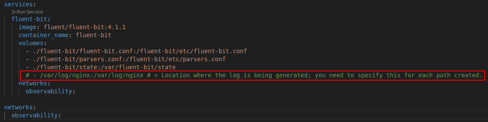
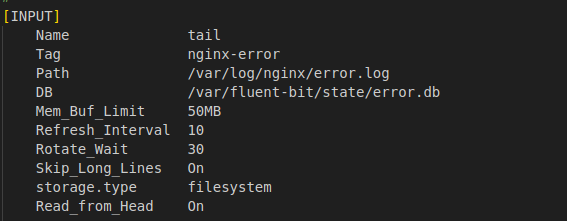
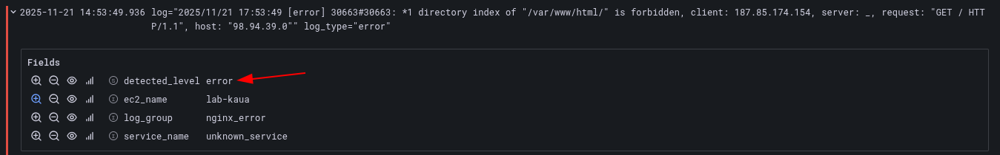
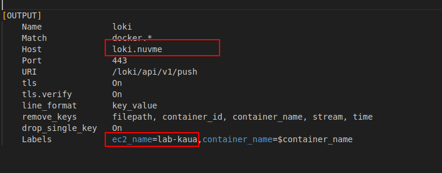

# fluent-bit

Fluent Bit is an open-source and lightweight log processor and forwarder designed for collecting, parsing, and shipping logs from diverse sources. It runs with minimal resource usage, making it suitable for high-performance environments, edge devices, and large-scale clusters.

Fluent Bit is part of the experience developed by Treasure Data and the Fluentd ecosystem, bringing a more efficient, embedded-friendly engine while keeping compatibility with modern logging pipelines. It delivers flexible input/output plugins, structured log processing, and reliable delivery.

Fluent Bit is a graduated project under the Cloud Native Computing Foundation (CNCF). If your organization relies on distributed systems, observability pipelines, or container-orchestrated workloads, contributing to CNCF helps influence the direction of cloud-native logging and telemetry. For more on the project’s role and community support, check the CNCF project information.

----

## Start

First check that host have docker installed, if not, you need to run these commands:
<!-- sudo apt update
curl -fsSL https://get.docker.com | sh && \
sudo usermod -aG docker ubuntu && \
newgrp docker && \
sudo curl -L "https://github.com/docker/compose/releases/latest/download/docker-compose-$(uname -s)-$(uname -m)" -o /usr/local/bin/docker-compose && \
sudo chmod +x /usr/local/bin/docker-compose && \ -->

If you need to get logs about your application inside the host, and not use docker use the "single" dir

Starting from the dockerfile, you need to indicate the path of the logs in fluent-bit container, follows below is an example

the input is the first step. In this section we detail where fluent-bit needs to listen.
When you configure, you need to adjust 2 params:
    Tag               nginx-error ### name of the label that show in grafana
    Path              /var/log/nginx/error.log ### name of the log, that the fluent-bit see

[FILTER]
    Name              record_modifier
    Match             nginx-error
    Record            log_type error

Show the level type of log, if are error or access, example.

The OUTPUT is the section that forwards all the input after the filter to loki, the config is single, if you use internal configuration set the ip address where loki will run
If the internal connection is simple, you only need to change the ip where loki runs
If loki runs in the K8s cluster, you need to change to url path with TLS

#### If loki run in the K8s, you need to change to this OUTPUT example:
[OUTPUT]
    Name              loki
    Match             nginx-access
    Host              https://loki.nuvme
    Port              80
    URI               /loki/api/v1/push
    tls               On
    tls.verify        On
    line_format       key_value
    drop_single_key   On
    Labels            ec2_name=lab-kaua,log_group=nginx_access

### Logs inside containers

First check that host have docker installed, if not, you need to run these commands:
<!-- sudo apt update
curl -fsSL https://get.docker.com | sh && \
sudo usermod -aG docker ubuntu && \
newgrp docker && \
sudo curl -L "https://github.com/docker/compose/releases/latest/download/docker-compose-$(uname -s)-$(uname -m)" -o /usr/local/bin/docker-compose && \
sudo chmod +x /usr/local/bin/docker-compose && \ -->

docker-compose, parsers.conf and container_labels.lua don't need adjusts, only fluent-bit.conf

Adjust to client OUTPUT, same scheme of the single, for for Loki on an alb, use TLS, running on an ec2 on the same network, use without